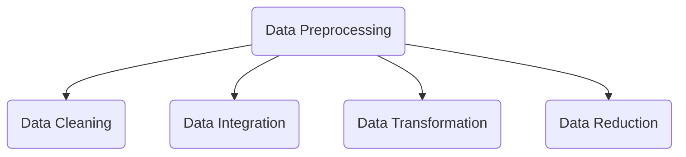

### 2.1. Data Preprocessing

Data preprocessing is a step in the data mining and data analysis process that takes raw data and transforms it into a format that can be understood and analyzed by computers and machine learning.

Data preprocessing is important to improve the overall data quality. 

Why is data preprocessing important?
-   Duplicate or missing values may give an incorrect view of the overall statistics of data.
-   Outliers and inconsistent data points often tend to disturb the model’s overall learning, leading to false predictions.

Data preprocessing handles them.

There are **four main steps** of data preprocessing.

 

#### 2.1.1. Data Cleaning
**Data cleaning** is the process of adding missing data and correcting, repairing, or removing incorrect or irrelevant data from a dataset.

- **Missing data:** Some data is missing in the dataset. It can be handled in various ways:
	- **Ignore the tuples:** when dataset is huge and multiple values are missing within a tuple.
	
	- **Fill the missing values:** fill the missing values manually, by attribute mean or the most probable value.

- **Noisy data:** It is a meaningless data. It can be generated due to faulty data collection, data entry errors. It can be handled in following ways :
	- **Binning:** It works on sorted data values. The data is divided into equal-sized bins, and each bin/bucket is dealt with independently. Income, for example, could be grouped: $35,000-$50,000, $50,000-$75,000, etc
	
	- **Regression:** It helps to smoothen noise by fitting all the data points in a regression function. The regression used may be linear (having one independent variable) or multiple (having multiple independent variables).
	
	- **Clustering:** Creation of groups/clusters from data having similar values. The values that don't lie in the cluster can be treated as noisy data and can be removed.

 

#### 2.1.2. Data Integration

**Data integration** is one of the data preprocessing steps that are used to merge the data present in multiple sources into a single larger data store like a data warehouse.

 

#### 2.1.3. Data Transformation

**Data transformation** is taken in order to transform the data in appropriate forms suitable for mining process. This involves following ways:
-  **Aggregation:** Data aggregation combines all of your data together in a uniform format.

-  **Normalization:** It is done in order to scale the data values in a specified range (-1.0 to 1.0 or 0.0 to 1.0).
	-   Min-max normalization
	-   Z-Score normalization
	-   Decimal scaling normalization

-  **Feature selection:** Feature selection is the process of deciding which variables are most important to your analysis. New properties of data are created from existing attributes to help in the data mining process.

-  **Discreditization:** This is done to replace the raw values of numeric attribute by interval levels or conceptual levels.

-  **Concept hierarchy generation:** Concept hierarchy generation can add a hierarchy within and between your features that wasn’t present in the original data. If your analysis contains wolves and coyotes, for example, you could add the hierarchy for their genus: _canis_.

 

#### 2.1.4. Data Reduction

The size of the dataset can be too large to be handled by data analysis and data mining algorithms.

One possible solution is to obtain a reduced representation of the dataset that is much smaller in volume but produces the same quality of analytical results. For this, we use **data reduction** techniques.

- **Data Cube Aggregation:** It is a way of data reduction, in which the gathered data is expressed in a summary form.

- **Attribute Subset Selection:** The highly relevant attributes should be used, rest all can be discarded. It, essentially, combines tags or features.

- **Numerosity Reduction:** The data can be represented as a model or equation like a regression model. This would save the burden of storing huge datasets instead of a model.

- **Dimensionality Reduction:** This technique aims to reduce the number of redundant features we consider in machine learning algorithms. Dimensionality reduction can be done using techniques like Principal Component Analysis etc.

 

----

**An example for Data Preprocessing can be found** [here.](https://github.com/crncck/Machine-Learning/blob/main/DataPreprocessing/DataPreprocessing.ipynb)
