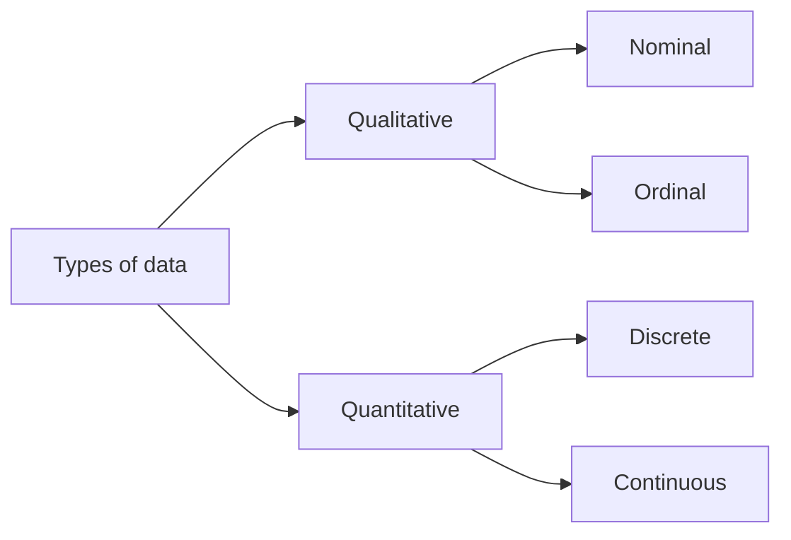

# Machine Learning

**Machine learning** is the use and development of computer systems that are able to learn and adapt without following explicit instructions, by using algorithms and statistical models to analyze and draw inferences from patterns in data.

Machine learning is used in various applications like –  **voice search technology, image recognition, automated translation, self-driven cars**, etc.

## 1. Basic Concepts in Machine Learning

### 1.1. Types of Data

- **Quantitative data** is data that can be counted or measured in numerical values.
	- To Visualize: histogram, box plots, scatter plots
		- Discrete: countable
		- Continuous: measurable

- **Qualitative data** describes qualities or characteristics.
	- To Visualize: bar charts, dot charts
		- Nominal: labelled categories
		- Ordinal: ordered categories
	

