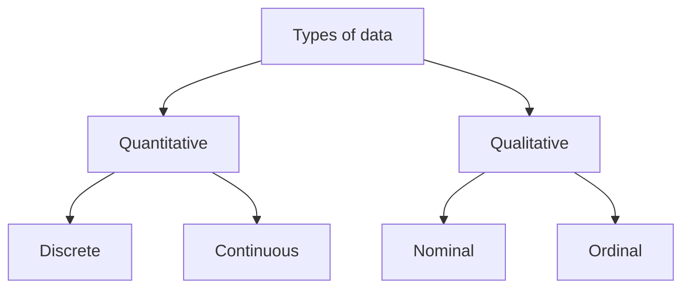
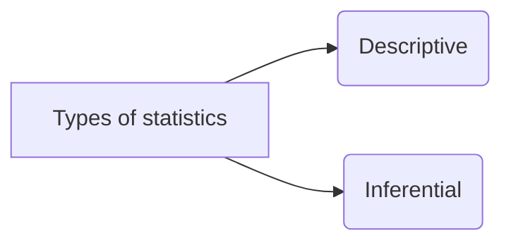
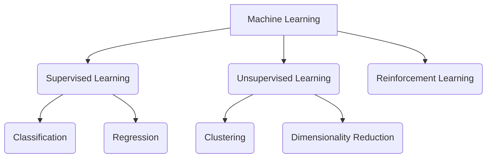

# Machine Learning

**Machine learning** is the use and development of computer systems that are able to learn and adapt without following explicit instructions, by using algorithms and statistical models to analyze and draw inferences from patterns in data.

Machine learning is used in various applications like –  **voice search technology, image recognition, automated translation, self-driven cars**, etc.

 

## 1. Basic Concepts in Machine Learning

### 1.1. Types of Data

- **Quantitative data** is data that can be counted or measured in numerical values.
	- To Visualize: histogram, box plots, scatter plots
		- Discrete: countable
		- Continuous: measurable

- **Qualitative data** describes qualities or characteristics.
	- To Visualize: bar charts, dot charts
		- Nominal: labelled categories
		- Ordinal: ordered categories
	
 

### 1.2. Types of Statistics

- **Descriptive Statistics**:  Summarizes the characteristics of a data set and gives information about raw data regarding its description or features.
	- Measures of central tendency
		-  Mean
		- Median
		- Mode
	-  Measures of dispersion
		- Range
		- Standard deviation
		- Variance
	- Frequency distributions
	- Histograms

 

- **Inferential Statistics**: the practice of using sampled data to draw conclusions or make predictions about a larger sample data sample or population.
	- Linear regression
	- Logistic regression
	- LDA & KNN
	- Decision trees and more..

 

### 1.3. Learning Types

 

**1-Supervised Learning**: Use of labeled datasets to train algorithms that to classify data or predict outcomes accurately.

- Classification: It is the task of predicting a discrete class label. ***Examples**, fraud detection, email spam detection, diagnostics, image classification.*
	-  K-Nearest Neighbor
	- Logistic Regression
	- Support Vector Machines
	- Decision Trees
	- Artificial Neural Networks

- Regression: It is the task of predicting a continuous quantity. ***Examples**, risk assessment, score prediction.*
	- Linear Regression
	- Polynomial Regression
	- Support Vector Regression
	- Decision Tree Regression
	- Multiple Linear Regression
	- Random Forest Regression

 

**2-Unsupervised Learning**: Use of machine learning algorithms to analyze and cluster unlabeled datasets. These algorithms discover hidden patterns or data groupings without the need for human intervention.

- Clustering: It is identifying and grouping similar data points in larger datasets without concern for the specific outcome. ***Examples**, biology, city planning, targetted marketing.*
	-  K-Means Clustering
	- Hierarchical Clustering

- Dimensionality Reduction: It is a statistical technique of reducing the amount of random variables in a problem by obtaining a set of principal variables. ***Examples**, text mining, face recognition, image recognition, big data visualization.*
	- PCA
	- Kernel PCA

 

**3-Reinforcement Learning**: It is a method based on rewarding desired behaviors and/or punishing undesired ones. A reinforcement learning agent is able to perceive and interpret its environment, take actions and learn through trial and error. ***Examples**, gaming, finance sector, inventory management, robot navigation.*
- Q-Learning
- State-Action-Reward-State-Action (SARSA)
- Deep Q Network (DQN)

 

### 1.4. Steps in Building Machine Learning Model

 1.  Problem formulation
 2. Data tidying
 3. Data Preprocessing
	- Filter data
	- Missing value imputation
	- Outlier treatment
	- Feature selection
	- Dimension reduction
	- Feature scaling
		- Standardization
		- Normalization
 4. Train-Test Split
 5. Model Building
 6. Performance Metrics and Validation
 7. Prediction
